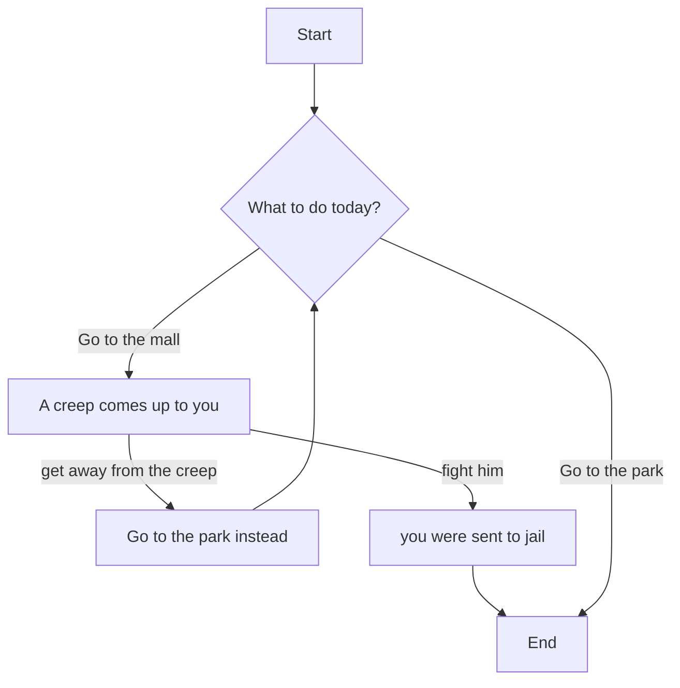

Throughout the decisions, the player would be faced with 2 decisions.
First in line 3 it asks the question for the player, which is whether to go to the park or the mall. 
If the player decides to go to the park it shows them to line 9 which should direct them directly to the end, nothing eventful happened. 
If the player decides to go to the mall instead they are shown a scenario, in this case C, in which a creep comes up to them.
From there, they can decide to fight the creep which gets them sent to jail, F, then sends them to the end. 
If they decide not to fight the creep they decide to go to the park instead. This sends them through the same line as the original line 3 decision but if they chose to go to the park instead. This also sends them to the end. 
A is where all players start, B is if players decide to go to the mall, C is the event at the mall where a creep appears, D is going to the park, E is the end, F is the outcome of fighting the creep at scenario C.
